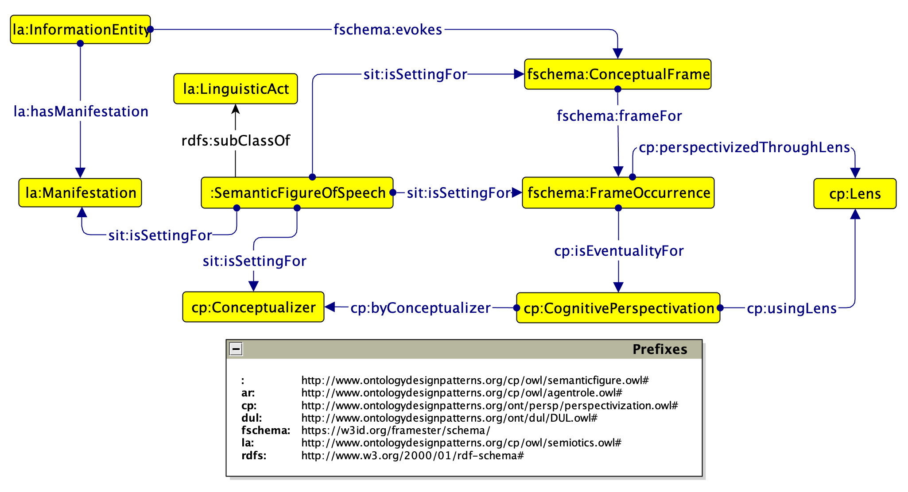

# Discovery and Modeling of Knowledge Patterns from Tropes in Scientific Texts 

## Description
This project aims to bridge the gap in natural language processing by exploiting state-of-the-art knowledge extraction and representation techniques to discover and model knowledge patterns (KPs) in scientific texts. The focus is on the hybridization of natural language processing and semantic technologies to foster the formalization and extraction of KPs from text used in a non-literal sense and in an abstractive form.

### Problem Statement
Scientific literature often leverages tropes like metaphors and analogies to convey complex concepts. While these rhetorical devices can enrich communication, they also have the potential to constrain understanding and perpetuate outdated paradigms. This work seeks to analyze and model how tropes shape scientific discourse, with the goal of enhancing knowledge representation and extraction techniques.

### Importance
Understanding the evolution of scientific knowledge is not just an academic exercise—it influences research directions, funding decisions, and policy-making. By examining the patterns and framing of tropes in scientific literature, this project seeks to illuminate how scientific language evolves and contributes to interdisciplinary research and public understanding.

